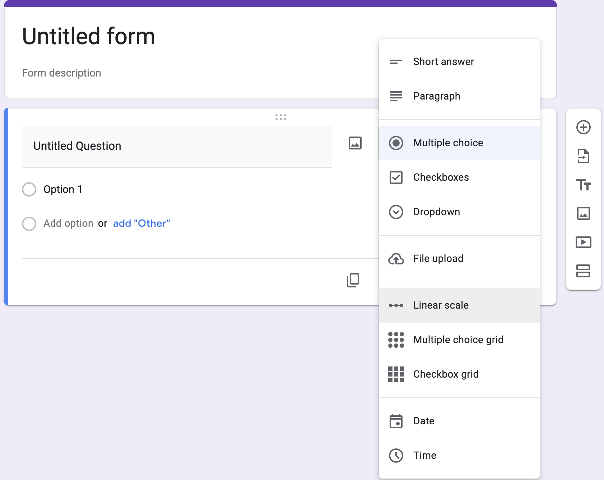
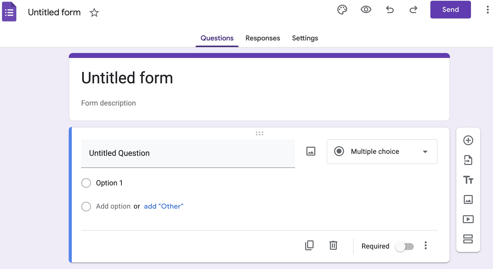
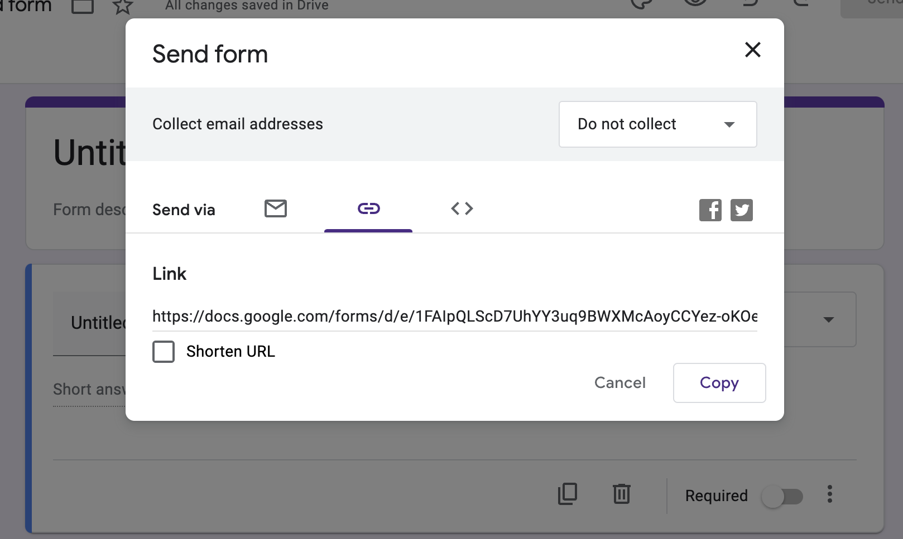

# Google Forms in the Classroom

Google Forms offers a practical solution for classroom interaction, aiding tasks like attendance and posting quick questions. This tutorial delves into using Google Forms in educational settings.

There are two main ways to use Google Forms:

[1]. **Web Browsers** (Graphic User Interface): This is the most common method. It's straightforward and covers most needs.  
[2]. **Google Forms API**: This is a more complex yet powerful method. It allows for bulk generation and retrieval of forms, minimizing manual errors. For more on Google Forms API and potential issues, consult the other guide titled **“Introducing Google Forms API with Python”** in this repository.
For this guide, we’ll focus on the browser-based approach.

Note: While Google Forms requires a Google account, be aware that university-associated Google email services (e.g., email_name@utexas.edu) might not offer full access to all Google features.

## Steps:

[1]. **Accessing Google Forms:**
- Enter “google forms” in a browser, and usually, the first result is the Google Forms page.
- Click “Go To Forms” and sign in with your Google account.

- On the Google Forms page, choose ‘Blank’ under ‘Start a new form’ to begin.

[2]. **Creating Your Form:**
- Edit the form's title, description, and question format. ‘Short answer’ is a common format.

- Add questions using the ‘plus’ sign. You can also mark questions as ‘required’.

[3]. **Distributing Your Form:**
- To send the form, click “Send” in the top-right corner. You can:
  - Email it directly.
  - Share a link (often the most convenient).
  - Embed the form using HTML.

[4]. **Converting Links to QR Codes:**
- For classroom ease, convert textual links to QR codes and project them.
- Visit a QR code generator like “https://www.the-qrcode-generator.com/”.
- Paste the form link, generate the QR code, and download or screenshot it (use **cmd+shift+4** on a Mac).

[5]. **Reviewing Responses:**
- Return to Google Forms and select ‘Responses’.
- You’ll see entries as respondents submit.
- If needed, disable further submissions by toggling off ‘accepting responses’.
- Download the responses as a csv file for analysis in Excel or other tools.