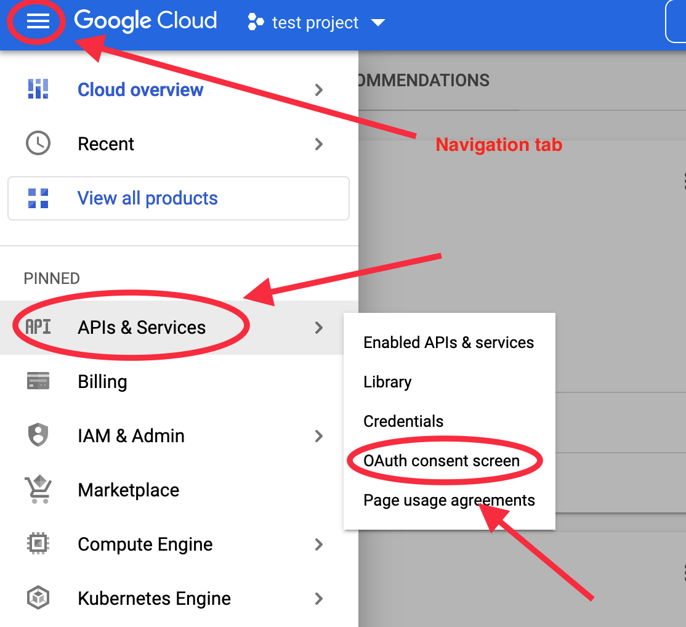

<font size = 6> **Introducing Google Forms API with Python** </font>

# I Purpose and Application

Google Forms can be a convenient tool for interacting with students in the classroom, performing tasks such as taking attendance and posting short questions. This tutorial will introduce Google APIs’ authentication, Google Forms API (including creating and manipulating forms and retrieving data), and QR code generation. 

The application scenario I have with Google Forms API is limited to teaching. Among many challenges produced by the Pandemic and post-Pandemic adjustment is how to interact with students in a hybrid-mode class. Sometimes the instructor might want students to respond to instant questionnaires. A typical example is attendance-taking. For zoom users (remote students), digital formats (links, websites, or online-learning systems such as Canvas) are more convenient; for in-person students, physical formats (hard-copy forms) might be better. Therefore, I managed to find a middle ground that uses Google Forms and projects the associated QR code on the classroom’s screen so that both remote and in-person students can use cell phones to scan the code to access the questions. The in-person students may not have laptops with them in class, but not their cell phones. Google Forms are more flexible compared with many other online learning systems managed by the university (for instance, Duo-authentication can be quite a hassle that disrupts the flow of the class.) I have kept using Google Forms after returning to full in-person teaching. Furthermore, digital questionnaires are instrumental for easy data retrieval. Sometimes course instructors would want to post instant questions in class and let the student write down the answer, which serves the purposes of both class interaction and attendance-taking. The students often have to scramble to find a sheet of paper, and after the class, the TA would need to collect answer sheets that are in a variety of shapes and sizes from the students and manually input the data online. Using google forms and QR codes in this scenario would make it easier for both the student and the TA, especially in situations when the size of the class is over two hundred students, which is often the case for US history survey courses. The digital format also provides the added functionality of instantly aggregating and displaying students’ responses.

Cloud services (Amazon Web Services, Microsoft Azure, Google Cloud, Alibaba Cloud) provide users with access to remote resources for computing. Data storage oriented to average customers, such as iCloud and Dropbox, is part of cloud services in the broad definition. Obviously, Google Forms is provided by Google, and we will be working with Google Cloud in this tutorial. API (Application Programming Interface) refers to the way of communication among computer programs. Since we will be writing snippets of Python code to interact with Google Forms, we will need to use the appropriate API to let our code communicate with Google Forms. Naturally, the ‘appropriate API’(Google Forms API in this case) is constructed and provided by none other than Google. Obviously, this tutorial also requires some preliminary knowledge of Python and the terminal interface. 


# II Google Cloud and Google API Authentication


This section provides a step-by-step guide through the process of setting up a Google Cloud project, enabling Google Forms API, and acquiring an Authentication client (a JSON file). Enabling and authenticating other Google APIs follow similar steps.  

## Step 1 Google Cloud Set-up. 

1.	Go to Google Cloud [https://cloud.google.com](https://cloud.google.com);
2.	on the top right corner, click ‘**start free**’ or ‘**sign in**’ if you already have a Gmail account; 
3.	After signing in, click ‘**Console**’ on the top right corner.

## Step 2 Create a Project


1. Go to the drop-down manual '**Select a project**' and then click '**New project**' to create a new project, as the images below show.

	
	<hr>
	
	
	<hr>

2. Give a name to the project. It can be any name as long as it is easy to recognize and remember, then click on “create.” Ignore the “Location.” When the project is successfully created, the upper right corner of the window will pop up a notification.

	<hr>

3. To view the project, either click '**SELECT PROJECT**' in the ‘Notifications’ or go to the drop-down menu on the up left to select the project just created
	
	<hr>

## Step 3  Authentication

1.	Go to **navigation tab** —> **APIs & Services** —> **OAuth consent screen**
	
	<hr>

2. Select ‘**External**’ (Internal requires Google Workspace user), and then click ’**CREATE**’ 
	
	<hr>

3. A new page, ‘**Edit app registration**’ will show up

	Enter 

	- ‘**App name**’: it can be anything as long as it is easy to remember
	- “**User support email**”: your email
	- “**Developer contact info**”: your email
	- Click '**SAVE AND CONTINUE**'
	- Skip ‘**ADD OR REMOVE SCOPES**’ since we will prescribe the scope in our script.
	- Click '**SAVE AND CONTINUE**'
	- Click '**SAVE AND CONTINUE**' again
	- Click '**BACK TO DASHBOARD**’
	
	<hr>

4. enable the Google Forms API 

	**navigation tab** —>**APIs & Services** —> **Library** —> type “**Google Forms**’ in the search bar in the center.
	
	<hr>

	Google provides over four hundred APIs, including Gmail, Youtube, Google Drive, etc. We will only focus on Google Forms API here, but the procedures are essentially the same for the rest.

	Once the Google Forms API shows up, click it and then click “**ENABLE**.”
	
	<hr>
	
	Find the ‘Credentials’ tab on the right side, click ‘**Credentials**’ —> ‘**CREATE CREDENTIALS**’
	
	<hr>

	There will be several options available for authentication methods. Usually API key is the fastest and easiest one. But Google also has set limits on the privileges and functionalities an API key is allowed to grant. Hence here we will use “OAuth client ID”

	In the drop-down menu of ‘**Application type**’ choose ‘**Desktop app’**

	type a name in the following blank field, it can anything as long as it is easy to remember.

	Then click ‘**CREATE**.’
	
	<hr>

	the OAuth client is successfully created. The client is a JSON file that can be downloaded by
clicking ‘DOWNLOAD JSON.’

	Alternatively, the file can be downloaded through **navigation tab**—>**APIs & Services** —> **Credentials** —> Download the JSON file 


# III Google Forms API with Python

This section will first walk through the programming environment setup and then the code that works on Google Forms.

## 1. environment setup

This tutorial requires installing the programming language 

1. **Python**(version 3.7 or greater) 

	and a handful of Python packages that includes

2. **Pandas**;
3. **qrcode**;
4. **google-auth-oauthlib**;
5. **google-api-python-client**.

The simplest way to install python is to download it from its [official website (installation instructions)](https://www.python.org/downloads). However, a more efficient way is to install Anaconda, an environment and package management software that automatically installs Python and a set of commonly used python packages(including Pandas). 

- download and install [Anaconda (installation instruction)](https://docs.anaconda.com/anaconda/install/index.html); 
- run the following command in the terminal (for how to open the terminal on Mac, see [this guide](https://support.apple.com/guide/terminal/open-or-quit-terminal-apd5265185d-f365-44cb-8b09-71a064a42125/mac) to install the rest packages.

```
conda install -c conda-forge qrcode google-auth-oauthlib google-api-python-client

```

Alternatively, if you choose to skip Anaconda and use install python from its official website:

- type the following command in the terminal to install the necessary packages

```
pip install pandas qrcode[pil] google-auth-oauthlib google-api-python-client

```

## 2. Authentication with Google Forms API

There are two separate pythonic ways developed by Google to engage with Google Cloud Platform services. They are [Google API Python client library](https://github.com/googleapis/google-api-python-client) and [Google Cloud Python Client](https://github.com/googleapis/google-cloud-python). The latter, which consists of numerous packages that are each specifically oriented to one particular Google Cloud service, is the recommended way by Google. However, Google Forms is not included in the latter, and thereby we will work only with Google API Python client, which is already installed in the last section. 

To authenticate with Google Forms, four crucial pieces of information are indispensable. For the Google Forms API Documentation, see [https://developers.google.com/forms/api/reference/rest](https://developers.google.com/forms/api/reference/rest)

- OAuth client file(the JSON file downloaded in Step 3 Authentication.)
- the API's name ("forms")
- the API's version ("v1")
- the Scopes the API allowed to operate(a scope is simply a url link)
	- the scope for creating forms is 
	
		"**https://www.googleapis.com/auth/forms.body**"; 
	- the scope for retrieving form responses is 

		"**https://www.googleapis.com/auth/forms.responses.readonly**."

All reparation work is done. We will start coding now!

- load the relevant packages first

	```
	from googleapiclient.discovery import build
	from google_auth_oauthlib.flow import InstalledAppFlow
	import pandas as pd
	import qrcode
	
	```
- define constants.
	The OAUTH\_CLIENT\_JSON should be the file path leading to the OAuth client file

	```
	API_NAME = "forms"
	API_VERSION = "v1"
	FORM_SCOPES = "https://www.googleapis.com/auth/forms.body"
	RESPONSE_SCOPES = "https://www.googleapis.com/auth/forms.responses.readonly"
	
	# the file path below should be replaced unless the JSON file is in the same directory as the code.
	OAUTH_CLINT_JSON = "/oauth_client.json" 
	
	
	```

- connect to Google Forms
	
	```
	flow =InstalledAppFlow.from_client_secrets_file(json_secret_fp, scopes =[FORM_SCOPES,RESPONSE_SCOPES])
	flow.run_local_server()
	cre = flow.credentials
	service= build('forms', 'v1', credentials = cre)


	```

the `service` object will be the base of all subsequent operations, after which `service.close()` is needed to end the connection. In the meantime, the web browser will automatically open a Google Account authentication page that lets you sign in or choose an account to grant permission to the connection your code just made to the Google Forms server. If you are running the code in the terminal, a link to the authentication web page will also appear.


## 3. Create and update a Form

A new form must be created before adding any content to the forms. Structure the new form in a dictionary and feed it into the `create()` method.

- create a form

```
# document_title and form_tile are two string variables
document_title = "the document's title you give"
form_title = "the form's title you give'

new_form = {
            "info": {
                "documentTitle": document_title,
                  "title": form_title,
                }
            }


form = service.forms().create(body=new_form).execute()            
# now, a form object is created. go to Google Forms' website, 
# a new form with the given titles should appear.


```

- update the form with a description

Once the form is created, we can now populate it with descriptions and questions by form id.

```
# The form is a dictionary object that includes two important items, "formId" and "responseUri"

form_id = form['formId']

# desciption is a string variable of a short text that will be displayed to the form users.

description = "describe what the form is for" 

des_info = {
				"requests": [{
               	"updateFormInfo": {
                     "info": {
                          "description": description
                       },
                       "updateMask": "description"
                    }
                }]
            }


# The form is updated with the method batchUpdate()

service.forms().batchUpdate(formId=form_id, body = des_info).execute()

# now, the form is added with a description. 


```

- add a question

```

# question_content is a string variable representing the content of the question
question_content = "what is the weather today"

# question_postion is an integer variable. when adding a new question, 
# the location index where the question will be inserted must be provided. 
# It starts from the integer 0, which means the first question. 
question_position = 0

# required is a boolean variable stipulating whether answering the question is optional for the users.
required = True

new_question = {
   "requests": [{
       "createItem": {
           "item": {
               "title":questionContent,
               "questionItem":{
                   "question":{
                   "required": required, 
                   "textQuestion":{
                       "paragraph":False
                   }
               }
                               }
           },
           "location": {
               "index": question_position}
       }
   }]

# when updating the form, the form id must be cited every time

service.forms().batchUpdate(formId=form_id, body = new_question).execute()


```

- retrieve the responses

```
responses = service.forms().responses().list(formId =form_id).execute()

# responses is a multi-level nested dictionary object 

# below is a function the unpack the responses object and extract response content.

def extract_answers(responses)
    l = []
    for i in responses['responses']:
        l.append((i['createTime'], i['answers']))

    l2 = [(item[0], list(item[1].values())) for item in l]

    def unpack(s):
        return [i['textAnswers']['answers'][0]['value'] for i in s]
    l3 = []
    for item in l2:
        l3.append((item[0], unpack(item[1])))

    return l3
    
result = extract_answers(responses)

# the output of extract_answer() is a list of responses. Each response is a tuple that contains two elements.
# The first element indicates the time when the response is submitted, and the second response is a list
# of question answers. The index of each answer corresponds to the question location index.
# For instance, ('2022-02-22T20:26:14.936Z', ['answerToQuestion1', 'answerToQuestion2', 'answerToQuestion3'])

# Furthermore, we can also convert the responses to a Pandas DataFrame and save them to a CSV file.

import Pandas as pd

df = pd.DataFrame.from_records(result, columns=['time','result'])
df = pd.concat([df['time'],df['result'].apply(pd.Series)], axis=1)
df.to_csv(output_file_path) # output_file_path is a string variable that sets the outputted CSV file's path. 


```
Google Forms API also offers other functionalities; for the full documentation, see [Google Forms Reference](https://developers.google.com/forms/api/reference/rest). The instructions above introduce only the basics - creating forms, updating forms, and retrieving responses. 

## Generating QR Code

This section will introduce how to convert the URLs to the forms to QR codes.

```

import qrcode

 # 'responseUri' is another crucial item in the dictionary object form.
   
url = form["responseUri"]

# The qr code is an image file, and `image_out_put_path` is a string variable for saving the image file.  

image_out_put_path = "output_qrcode"
											
img =qrcode.make(url)
img.save(image_out_put_path)


# close the connection to the google forms server.
service.close()


```

The section below briefly talks about the limits and potential problems of Google Forms API and computational tools in general.


# IV Problems and Reflection

Although Google Forms is an efficient, convenient, and reliable pedagogical tool, deploying it might still invite some potential problems. First, it requires the student to possess a smartphone equipped with a back camera when they come to class. Although this is usually assumed to be the case, I did encounter one student who kept not bringing any cell phone with him to class. Other possible issues include the strength of the wifi signal in a given classroom, although I have never received any complaints about it from students.

Secondly, there will always be some general concerns about utilizing digital tools. Google LLC, founded only about twenty years ago, has now grown into a business and technology giant that deeply shapes our daily life. Its search engine is probably the most ubiquitous digital functionality we seem not able to live without, not to mention the numerous sophisticated machine-learning models developed by Google behind many everyday technologies we have taken for granted and have been enjoying for free. This tutorial only introduces an extremely tiny part of the free services offered by Google, and it already has the potential to change the ways of class interaction. One cannot help but imagine how our teaching and research would be transformed if more and more new functionalities were deployed. However, we also need to realize the free and accessible services provided by Google are held up by a huge infrastructure that incorporates not only sprawling hardware around the globe but also the social constructs, such as the market, that are no less than crucial. Just to give an example, the accuracy and potency of machine learning models, to a great extent, rely on an immense amount of training data that can only be supported by a very large market. This is partly the reason why English is a hegemonic language in Natural Language Processing and why the language of Chinese might be one of the few strong competitors. What I attempt to suggest here is that the everyday technologies we take for granted on the surface are not much so in reality; the macro-structural factors operating behind them do not remain the same everywhere or unchanged forever. They are evolving, albeit slowly. What if Google went bankrupt, or became inaccessible, or simply changed its policy someday? In fact, many Google services are not available in some countries(such as China) or on devices produced by certain companies(such as Huawei.) Long-term sustainability and flexibility are but two of many questions that need to be addressed when scholars are engaging with digital pedagogy and methodology.


</font>